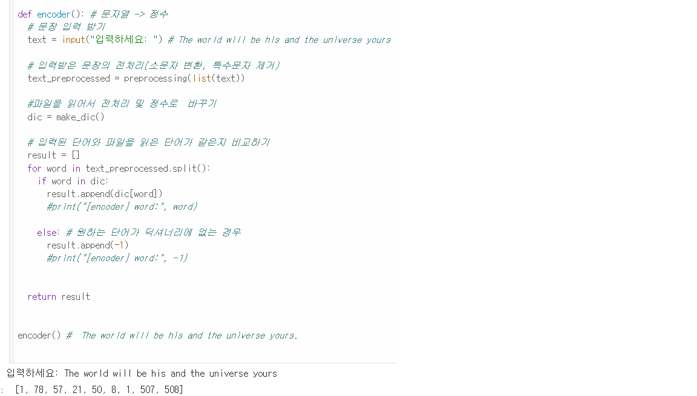
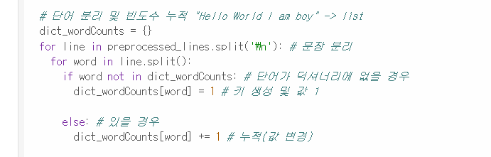

# AIFFEL Campus Online Code Peer Review Templete
- 코더 : 노은하
- 리뷰어 : 윤석진


# PRT(Peer Review Template)
- [o]  **1. 주어진 문제를 해결하는 완성된 코드가 제출되었나요?**
   - 완성된 코드가 잘 제출되었습니다.
      
    
- [o]  **2. 전체 코드에서 가장 핵심적이거나 가장 복잡하고 이해하기 어려운 부분에 작성된 
주석 또는 doc string을 보고 해당 코드가 잘 이해되었나요?**
    - 단어가 딕셔너리에 없을 경우 = 1, 있을 경우 += 1 을 해서 단어의 반복횟수를 기록하는 것이 가장 핵심적이고 어려운 부분이라고 생각했고, 또한 이해도 잘 되었습니다.
      
        
- [o]  **3. 에러가 난 부분을 디버깅하여 문제를 해결한 기록을 남겼거나
새로운 시도 또는 추가 실험을 수행해봤나요?**
    - line.split()에 있는 단어들을 for문으로 빈 딕셔너리에 하나씩 넣어보고, dict_wordCounts[word]에 값을 지정하여 키:값을 만드는 방식이 저에겐 새롭게 느껴졌습니다.
      
        
- [o]  **4. 회고를 잘 작성했나요?**
    - 회고는 딱히 없네용
        
- [o]  **5. 코드가 간결하고 효율적인가요?**
    - 각 부분을 함수로 정리하여 간결하고 효율적이게 작성되었습니다.
      

# 회고(참고 링크 및 코드 개선)
```
가장 깔끔하고 전문적으로 보이는, 잘 작성된 코드인 것 같습니다.
```
